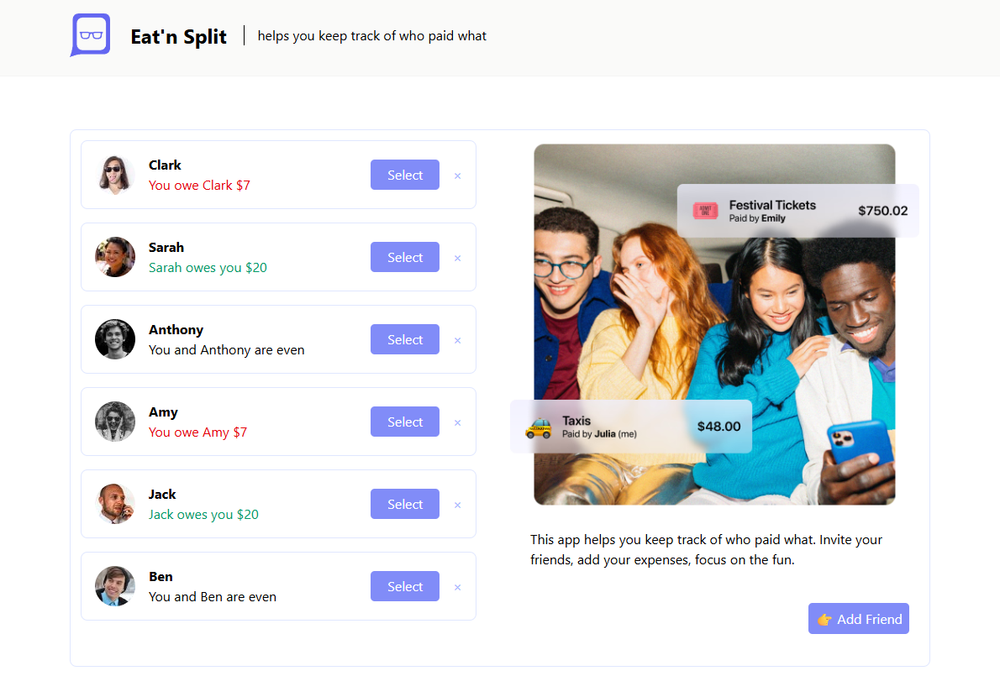

<h1>Eat'n Split</h1>

https://eatnsplitx.netlify.app/

  A project from a React JS training: This app helps you keep track of who paid what. 

## 👍 My Challenges:

- Tailwind CSS has been applied.
- Improving too many aspects of front-end design 🤗
- Button positions have been rearranged and a scrollbar feature has been added to the friends list section.
- A delete friend button and a warning window have been added.
- The difference between uppercase and lowercase letters was ignored.
- Special effort was made for responsive design.

## 🎉 Build With:

- React JS + Tailwind CSS
- Semantic HTML5 markup
- CSS Flexbox and Grid
- Mobile-first workflow
- Custom CSS properties
